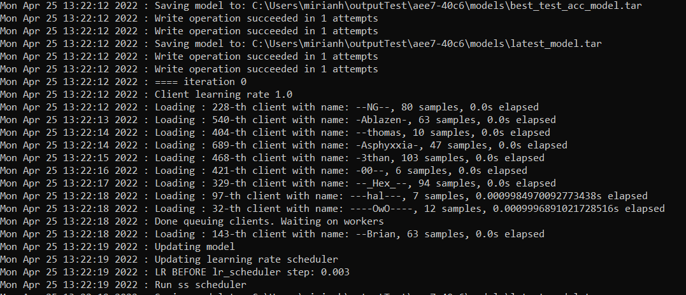

Launch FLUTE
================

Local run
------------

Install the requirements stated inside of requirements.txt. Ideally this sould be done inside of a virtual environment, for instance, using Anaconda.

.. code:: bash
    conda create -n FLUTE python==3.8
    pip install -r requirements.txt

You will also need some MPI runtime such as OpenMPI (on Linux) or MS-MPI (on Windows). There is no setup.py as FLUTE is not currently distributed as a package, but instead meant to run from the root of the repository.

After this initial setup you can use your data for launching a local run. However the following instructions will be adapted to run ``nlg_gru`` task. For running this example, you need to first download and preprocess the data. Instructions can be found `here`_.  Once the data is available you can run FLUTE from root as follows:

.. code:: bash

    mpiexec -n 3 python e2e_trainer.py -dataPath ./testing/mockup -outputPath scratch -config testing/configs/hello_world_local.yaml -task nlg_gru

.. _here: https://github.com/microsoft/msrflute/tree/main/testing

If the setup of the experiment has been done correctly, after the model initialization we would be able to see the clients being trained:

    Local run for nlg_gru task.

AML Run 
------------

FLUTE has a native integration for job submissions with Azure ML, allowing users to use the built-in CLI or web interface for job/experiment tracking.

For running experiments on AzureML, the CLI can help. You should first install the CLI `install the CLI`_ (make sure you have v2) and `create a resource group and workspace`_. You can then create a compute cluster, type ``az ml compute create -h`` for more info. Afterwards, you should write a YAML file with instructions for the job; we provide a simple example below:

.. _install the CLI: https://docs.microsoft.com/en-us/azure/machine-learning/reference-azure-machine-learning-cli
.. _create a resource group and workspace: https://docs.microsoft.com/en-us/azure/machine-learning/how-to-manage-workspace-cli?tabs=vnetpleconfigurationsv1cli%2Ccreatenewresources%2Cworkspaceupdatev1%2Cworkspacesynckeysv1%2Cworkspacedeletev1

.. code:: yaml

    experiment_name: basic_example
    description: Basic example of AML config for submitting FLUTE jobs
    code:
    local_path: .
    compute: azureml:Test
    environment:
    image: pytorch/pytorch:1.9.0-cuda10.2-cudnn7-devel
    inputs:
    data:
        folder: azureml://datastores/data/paths/cifar
        mode: rw_mount
    command: >
    apt -y update &&
    apt -y install openmpi-bin libopenmpi-dev openssh-client &&
    python3 -m pip install --upgrade pip &&
    python3 -m pip install -r requirements.txt &&
    mpiexec --allow-run-as-root -n 4 python e2e_trainer.py
    -outputPath=./outputs
    -dataPath={inputs.data}
    -task=classif_cnn
    -config=./experiments/classif_cnn/config.yaml|

You should replace ``compute`` with the name of the one you created before, and adjust the path of the datastore containing the data. In the example above, we created a datastore called ``data`` and added to it a folder called ``cifar``, which contained the two HDF5 files. The command passed above will install dependencies and then launch an MPI job with 4 threads, for the experiment defined in ``experiments/classif_cnn``. Details on how to run a job using the AzureML CLI are given in its `documentation`_ , but typically it suffices to set up the environment and type ``az ml job create -f <name-of-the-yaml-file>``. In the same page of the documentation, you can also find more info about how to set up the YAML file above, in case other changes are needed.

.. _documentation: https://docs.microsoft.com/en-us/azure/machine-learning/how-to-train-cli

.. note:: The local_path above is relative to the location of the YAML file. Setting it to ``.`` assumes it is in the same folder as ``e2e_trainer.py``. 
    
.. note:: All files on this folder will be uploaded to Azure, including hidden folders such as ``.git``, make sure to remove large files and folders that are not needed.

After launching the experiment, you can follow it on AzureML Studio, which prints logs, plots metrics and makes the output easily available after the experiment is finished.

