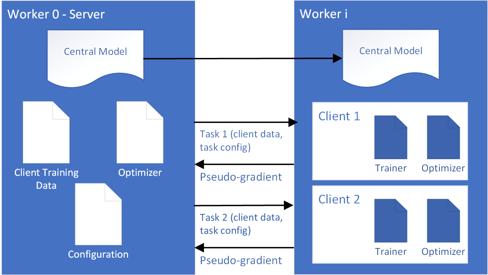
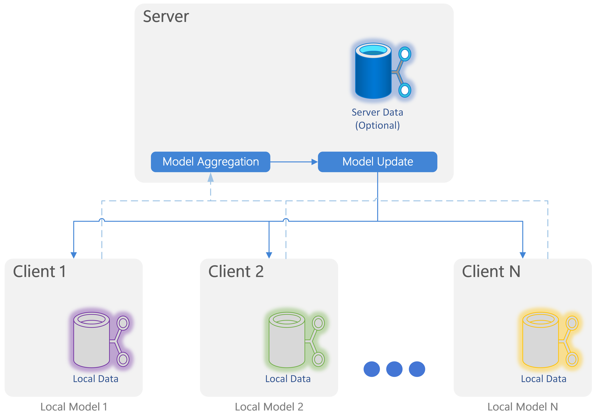

FLUTE Overview
============

FLUTE: Federated Learning Utilities and Tools for Experimentation is a high-performance open source platform that enables researchers and developers to perform rapid prototyping and offline simulations of novel federated learning algorithms at scale. 

An FLUTE job consists of one or more nodes (physical or virtual machines) executing a total of K workers that can become a Server or Client. 

    
    FLUTE uses a distributed processing architecture backed by torch.distributed. 

Worker 0 acts as a central orchestrator, maintaining and distributing the central model to workers, and subsequently distributing client tasks to them. On each training round the orchestrator takes care of:
    
    * Dispatch the central model to the rest of the workers
    * Queues up client tasks for workers to execute. 
    
Workers receive client tasks (client training data and training config) and:

    * Execute SGD on the central model using their client's training data
    * Send model delta (pseudo-gradient) back to the orchestrator. 

Each worker>0 processes client tasks sequentially, consisting of data encoding and one or more batch updates to the central model (note the central model is reset to its original state for each client task). As each client task completes, the model delta, aka the pseudo-gradient is sent back to the orchestrator for federation into a new central model.

Execution runs for up to N training rounds.  In each round the orchestrator may sample a subset of clients, and may also randomly delay pseudo-gradient updates from some clients to future rounds. The orchestrator will also periodically distribute evaluation tasks to determine model quality on validation and test data.

.. note:: AzureML generally expects there will be one worker per GPU on each node.

Architecture
------------

FLUTE design is based on a central server architecture.

    
    FLUTE logical workflow. 

The logical workflow performed is:

    1. Send and initial global model to clients.
    2. Train instances of the global model with locally available data on each client.
    3. Send training information to the Server (e.g. adapted models, logits, pseudo-gradients).
    4. Combine the returned information on the server to produce a new model.
    5. Optionally, update the logbal model with an additional server-side rehearsal step.
    6. Send the updated global model back to the clients.
    7. Repeat steps 2-6 after sampling a new subset of clients for the next training interation.

